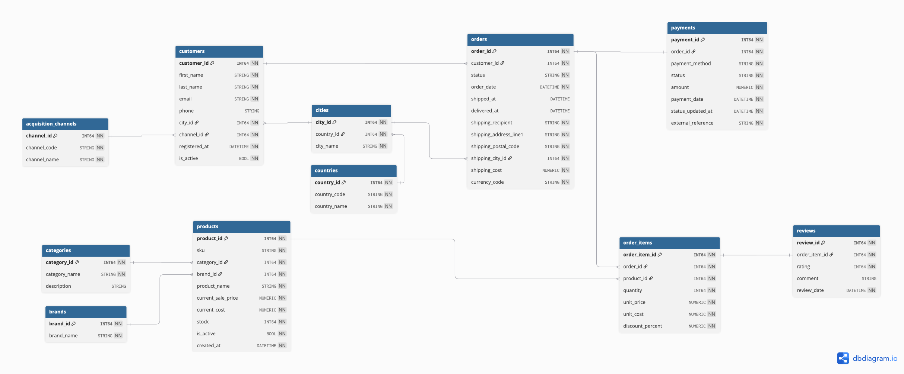

# Normalización y decisiones de diseño — SkeletIA

## 1. Objetivo del documento

Este documento justifica las decisiones de modelado de la base de datos relacional de **SkeletIA**, un e-commerce de productos tecnológicos.

El objetivo del diseño es mantener los datos consistentes, evitar redundancias innecesarias y reducir anomalías de inserción, actualización y borrado. El modelo se ha diseñado para cumplir, como mínimo, las formas normales exigidas en el proyecto:

- Primera Forma Normal (**1NF**)
- Segunda Forma Normal (**2NF**)
- Tercera Forma Normal (**3NF**)

Además, se revisa respecto a:

- Forma Normal de Boyce-Codd (**BCNF**)
- Cuarta Forma Normal (**4NF**)
- Quinta Forma Normal (**5NF**)

Estas tres últimas no son necesarias para cumplir el enunciado, pero se analizan porque el modelo permite hacerlo sin introducir fragmentaciones artificiales.

---

## 2. Resumen del modelo

El modelo está formado por 11 tablas:

| Tabla | Función principal |
|---|---|
| `countries` | Países en los que existen clientes o destinos |
| `cities` | Ciudades asociadas a un país |
| `acquisition_channels` | Canales por los que se adquieren clientes |
| `categories` | Categorías de productos |
| `brands` | Marcas de productos |
| `customers` | Datos principales de los clientes |
| `products` | Catálogo actual de productos |
| `orders` | Cabecera de los pedidos |
| `order_items` | Productos concretos incluidos en cada pedido |
| `payments` | Información de pago de los pedidos |
| `reviews` | Valoraciones de productos comprados y entregados |

Relaciones principales:



La relación entre `orders` y `products` es conceptualmente N:M y se resuelve mediante la tabla intermedia `order_items`.

---

## 3. Principios generales de normalización aplicados

La normalización busca principalmente evitar anomalías de actualización, inserción y borrado.

### Anomalías de actualización

Si un dato se almacena repetido en muchas filas, modificarlo exige actualizar todas ellas.

Ejemplo de diseño incorrecto:

```text
products
-----------------------------------------------------
product_id | product_name | category_name | brand_name
```

Si el nombre de una categoría cambia, habría que actualizar todos los productos de esa categoría.

En SkeletIA se almacena `products.category_id` y el nombre se mantiene una sola vez en `categories.category_name`.

### Anomalías de inserción

Una entidad debería poder existir sin necesidad de inventar datos de otra entidad. Una nueva marca se puede registrar en `brands` aunque todavía no tenga productos.

### Anomalías de borrado

Eliminar una fila no debería eliminar accidentalmente información independiente. Borrar el último producto de una marca no elimina la propia marca, porque `brands` es una entidad independiente.

---

## 4. Primera Forma Normal — 1NF

### 4.1 Requisitos

Una tabla cumple 1NF cuando:

1. cada fila representa una ocurrencia individual
2. cada columna contiene valores atómicos
3. no existen listas, arrays o grupos repetidos dentro de una misma celda
4. cada fila puede identificarse mediante una clave

El modelo SkeletIA cumple estos requisitos.

### 4.2 Atributos atómicos

No se almacenan listas de productos dentro de `orders` como:

```text
products = "producto 1, producto 2, producto 3"
```

En su lugar existe una fila independiente por producto comprado en `order_items`.

Tampoco se almacenan varios teléfonos, países o métodos de pago concatenados dentro de una misma columna.

### 4.3 Ausencia de grupos repetidos

Un diseño no normalizado podría contener:

```text
orders
--------------------------------------------------------------
order_id | product_1 | product_2 | product_3 | product_4
```

Ese diseño fijaría artificialmente un máximo de productos y obligaría a modificar el esquema para admitir más líneas.

SkeletIA lo resuelve con:

```text
orders
    1
    │
    N
order_items
```

### 4.4 Claves primarias

Todas las tablas tienen una PK propia:

| Tabla | PK |
|---|---|
| `countries` | `country_id` |
| `cities` | `city_id` |
| `acquisition_channels` | `channel_id` |
| `categories` | `category_id` |
| `brands` | `brand_id` |
| `customers` | `customer_id` |
| `products` | `product_id` |
| `orders` | `order_id` |
| `order_items` | `order_item_id` |
| `payments` | `payment_id` |
| `reviews` | `review_id` |

Se utilizan claves sustitutas numéricas porque proporcionan identificadores estables y permiten que atributos de negocio como nombres, códigos o emails cambien sin alterar las relaciones entre tablas.

**Conclusión:** el modelo cumple 1NF.

---

## 5. Segunda Forma Normal — 2NF

### 5.1 Requisitos

Una tabla cumple 2NF cuando:

1. cumple 1NF
2. todos los atributos que no sean una clave dependen de la clave completa
3. no existen dependencias parciales respecto a una clave compuesta

La mayoría de las tablas de SkeletIA utilizan una PK de una sola columna, por lo que no puede existir dependencia parcial respecto a esa PK.

Sin embargo, existen claves alternativas compuestas que conviene analizar.

### 5.2 `cities`

Además de `city_id`, se considera única la combinación:

```text
(country_id, city_name)
```

Esto evita tener dos veces la misma ciudad dentro del mismo país. El nombre de una ciudad por sí solo no identifica necesariamente una localidad globalmente.

### 5.3 `order_items`

`order_items` tiene una PK sustituta `order_item_id` y una clave alternativa única:

```text
(order_id, product_id)
```

La regla de negocio es que un producto aparece una sola vez dentro de un pedido y, si se compran varias unidades, se usa `quantity`.

Los atributos:

```text
quantity
unit_price
unit_cost
discount_percent
```

dependen de la línea de compra completa.

No dependen únicamente de `order_id`, porque un mismo pedido contiene diferentes productos.

Tampoco dependen únicamente de `product_id`, porque un mismo producto puede aparecer en muchos pedidos con cantidades, precios, costes y descuentos diferentes.

Por tanto:

```text
(order_id, product_id)
        ↓
quantity
unit_price
unit_cost
discount_percent
```

**Conclusión:** no existen dependencias parciales relevantes y el modelo cumple 2NF.

---

## 6. Tercera Forma Normal — 3NF

### 6.1 Requisitos

Una tabla cumple 3NF cuando:

1. cumple 2NF
2. los atributos que no sean una clave dependen de la clave
3. ningún atributo que no sea una clave depende funcionalmente de otro atributo que no sea una clave

En términos sencillos: cada tabla debe almacenar hechos sobre la entidad que representa y no hechos que realmente pertenezcan a otra entidad.

### 6.2 Países, ciudades y clientes

Un diseño menos normalizado podría almacenar:

```text
customers
-------------------------------------------------------
customer_id | city_name | country_code | country_name
```

pero aparecerían dependencias transitivas, ya que los datos del país no dependen directamente del cliente, sino de la ciudad asociada a este:

```text
customer_id
    ↓
city_id
    ↓
country_id
    ↓
country_code / country_name
```

SkeletIA separa estas entidades en:

```text
countries
    ↓
cities
    ↓
customers
```

La tabla `countries` almacena los datos propios del país, como `country_code` y `country_name`.

La tabla `cities` almacena `country_id` como clave foránea hacia `countries`.

En `customers` solo se almacena `city_id`. Para obtener el país de un cliente se sigue la relación:

```text
customers.city_id
→ cities.country_id
→ countries.country_id
```

De esta forma, `country_code` y `country_name` se almacenan una sola vez en `countries` y no se repiten para cada cliente.

### 6.3 Canales de adquisición

En vez de repetir un texto como `Organic search` en cada cliente, `customers` guarda `channel_id`, que referencia `acquisition_channels`.

Así `channel_code` y `channel_name` se mantienen una sola vez y la entidad puede ampliarse en el futuro sin modificar `customers`.

### 6.4 Productos, categorías y marcas

`products` no almacena `category_name` ni `brand_name`; almacena `category_id` y `brand_id`.

Esto evita dependencias transitivas como:

```text
product_id → category_id → category_name
product_id → brand_id → brand_name
```

### 6.5 Clientes y pedidos

`orders` almacena `customer_id`, pero no replica como datos maestros `first_name`, `last_name`, `email` o `phone`.

Guardar `customer_email` como dato maestro dentro de `orders` produciría:

```text
order_id → customer_id → customer_email
```

El email pertenece a `customers`.

**Conclusión:** el modelo separa entidades y evita dependencias transitivas innecesarias, por lo que cumple 3NF.

---

## 7. Decisión fundamental: `unit_price` en `order_items`

Esta es una de las decisiones más importantes del modelo.

`products` contiene:

```text
current_sale_price
current_cost
```

mientras que `order_items` contiene:

```text
unit_price
unit_cost
```

Aunque parezcan datos repetidos, representan hechos diferentes.

### 7.1 `products.current_sale_price`

Representa el precio de venta **actual** del producto en el catálogo.

Puede cambiar con el tiempo:

```text
01/01/2026 → 499 €
01/03/2026 → 549 €
01/09/2026 → 599 €
```

### 7.2 `order_items.unit_price`

Representa el precio que tenía una unidad del producto cuando se realizó una compra concreta.

Supongamos:

```text
Pedido 100
Fecha: 01/03/2026
Producto: 25
Precio: 549 €
```

Meses después:

```text
products.current_sale_price = 599 €
```

Si un pedido histórico se recalculase con el precio actual, su valor cambiaría retroactivamente.

Por eso `order_items.unit_price` es un **snapshot histórico**.

No depende solamente del producto; depende de la compra concreta:

```text
(order_id, product_id) → unit_price
```

Esto es compatible con 3NF porque el precio histórico describe la propia línea de pedido.

---

## 8. `unit_cost` histórico

Se aplica la misma lógica a:

```text
products.current_cost
```

y:

```text
order_items.unit_cost
```

`products.current_cost` representa el coste actual.

`order_items.unit_cost` representa el coste asociado al momento de la venta.

Esto permite calcular correctamente márgenes históricos. Si el coste actual cambiase por un nuevo proveedor, los márgenes de pedidos antiguos no deberían cambiar.

Por tanto, guardar `unit_cost` en `order_items` conserva la integridad histórica.

---

## 9. `discount_percent` pertenece a `order_items`

El descuento no es una propiedad permanente del producto.

Un mismo producto puede venderse:

```text
pedido A → 0 %
pedido B → 10 %
pedido C → 5 %
```

Por tanto:

```text
(order_id, product_id) → discount_percent
```

El descuento pertenece a la transacción concreta.

---

## 10. Por qué existe `order_items`

La relación entre pedidos y productos es `N:M`:

- un pedido puede contener muchos productos
- un producto puede aparecer en muchos pedidos

Las relaciones N:M se resuelven mediante una entidad asociativa:

```text
orders
    1
    │
    N
order_items
    N
    │
    1
products
```

Además, la relación tiene atributos propios:

```text
quantity
unit_price
unit_cost
discount_percent
```

Por eso `order_items` no es solo una tabla técnica: representa la **línea de pedido** como entidad de negocio.

---

## 11. Snapshot de dirección de envío en `orders`

`customers` almacena la ciudad asociada al cliente mediante `city_id`, pero `orders` contiene además:

```text
shipping_recipient
shipping_address_line1
shipping_postal_code
shipping_city_id
```

Esto es deliberado.

La dirección del pedido es un **snapshot histórico del destino de envío**.

### 11.1 Por qué no se lee siempre la dirección actual del cliente

Supongamos:

```text
Marzo: cliente vive en Madrid; pedido 100 se envía a Madrid.
Junio: cliente cambia su residencia a Barcelona.
```

El pedido 100 debe seguir mostrando Madrid como destino histórico.

### 11.2 Por qué no viola 3NF

Los campos de envío no representan la dirección maestra actual del cliente; representan la dirección usada por ese pedido.

Por tanto:

```text
order_id → shipping_recipient, shipping_address_line1,
           shipping_postal_code, shipping_city_id
```

Son atributos que describen directamente el pedido.

---

## 12. `shipping_city_id` sigue normalizado

Aunque la dirección sea histórica, la ciudad se representa mediante una FK a `cities`.

No se repiten en `orders` valores como:

```text
shipping_country_name
shipping_country_code
```

El país puede obtenerse mediante:

```text
orders.shipping_city_id
→ cities.country_id
→ countries
```

---

## 13. Diseño de `reviews`

`reviews` contiene:

```text
review_id
order_item_id
rating
comment
review_date
```

No contiene `customer_id`, `product_id` ni `order_id` porque esos datos son derivables.

Desde `order_item_id` se puede recorrer:

```text
reviews
    ↓
order_items
    ├── product_id
    └── order_id
            ↓
          orders
            ↓
        customer_id
```

Guardar también `product_id` o `customer_id` introduciría redundancia y permitiría contradicciones.

La valoración se asocia a una **compra concreta**, no únicamente al producto. Esto permite además aplicar la regla de que solo se valoran líneas pertenecientes a pedidos entregados.

---

## 14. Separación de `payments`

Los datos de pago se almacenan en una tabla independiente porque tienen propiedades propias:

```text
payment_method
status
amount
payment_date
status_updated_at
external_reference
```

Estas propiedades describen el proceso de pago, no la cabecera comercial del pedido.

En la simulación actual se genera un pago por pedido, pero mantener `payments` como entidad independiente permite que el modelo pueda evolucionar hacia intentos fallidos, reembolsos parciales o múltiples movimientos sin sobrecargar `orders`.

---

## 15. Por qué no se almacena el total del pedido en `orders`

El total comercial puede calcularse con:

```text
SUM(quantity × unit_price × (1 - discount_percent / 100))
+ shipping_cost
```

Los componentes necesarios ya existen en `order_items` y `orders.shipping_cost`.

No se añade una columna redundante `orders.total_amount`, evitando dos posibles fuentes de verdad.

`payments.amount`, en cambio, sí se conserva porque representa el importe del **evento de pago**. Durante la generación se valida que coincide con líneas + envío.

---

## 16. Datos maestros frente a dominios técnicos

### 16.1 Entidades maestras

Se utilizan tablas independientes para:

```text
countries
cities
acquisition_channels
categories
brands
```

Estas entidades pueden crecer, tener atributos propios y consultarse de forma independiente.

### 16.2 Dominios técnicos pequeños y cerrados

Los estados del pedido y del pago, así como el método de pago, forman dominios pequeños y controlados.

Ejemplos:

```text
orders.status:
cancelled, confirmed, delivered, pending, returned, shipped
```

```text
payments.payment_method:
apple_pay, bank_transfer, card, cash_on_delivery, google_pay, paypal, samsung_pay
```

```text
payments.status:
completed, failed, pending, refunded
```

BigQuery no tiene `ENUM` como si lo tiene el motor MySQL. En BigQuery se representan mediante `STRING` y su validez se comprueba en Python.

No se crean tablas de referencia independientes para estos valores porque son conjuntos pequeños, cerrados y sin atributos propios dentro del alcance actual.

---

## 17. Uso de claves sustitutas

Las principales entidades usan IDs numéricos:

```text
country_id
city_id
customer_id
product_id
order_id
...
```

No se utilizan como PK atributos de negocio como `email`, `sku` o `country_code`, aunque puedan ser únicos.

Las claves sustitutas:

- son estables
- no dependen de reglas comerciales
- simplifican las FK
- reducen el acoplamiento entre tablas

Los identificadores naturales importantes siguen validándose como únicos.

---

## 18. Unicidad lógica

Además de las claves primarias, el modelo define determinados campos
o combinaciones de campos que deben ser únicos por reglas de negocio.

Estas restricciones evitan duplicados que, aunque técnicamente podrían
tener claves primarias diferentes, representarían la misma entidad o
una situación incoherente dentro del modelo.

| Regla de unicidad | Explicación |
|---|---|
| `countries.country_code` | Cada país debe tener un código único. No tendría sentido que dos países distintos compartieran el mismo código, por ejemplo `ES`. |
| `countries.country_name` | El nombre del país no debe repetirse, ya que cada registro de `countries` representa un país diferente. |
| `(cities.country_id, cities.city_name)` | La combinación de país y ciudad debe ser única. Puede existir una ciudad con el mismo nombre en países distintos, pero no debería repetirse dos veces la misma ciudad dentro del mismo país. |
| `acquisition_channels.channel_code` | Cada canal de adquisición debe tener un código interno único, por ejemplo `organic` o `paid_ads`. |
| `acquisition_channels.channel_name` | El nombre descriptivo de cada canal debe ser único para evitar registrar dos veces el mismo canal con identificadores distintos. |
| `categories.category_name` | No deben existir dos categorías con el mismo nombre, ya que representarían la misma categoría de negocio. |
| `brands.brand_name` | Cada marca debe aparecer una sola vez en la tabla `brands`. |
| `customers.email` | En este modelo, cada dirección de correo electrónico identifica a un único cliente y no debe estar asociada a varios registros distintos. |
| `products.sku` | El SKU identifica comercialmente a un producto concreto, por lo que no puede repetirse entre productos diferentes. |
| `(order_items.order_id, order_items.product_id)` | Un mismo producto solo puede aparecer una vez dentro de un pedido. Si se compran varias unidades, se incrementa `quantity` en lugar de crear otra línea para el mismo producto. |
| `payments.external_reference` | La referencia externa de un pago debe ser única para poder identificar correctamente cada operación de pago y evitar duplicidades. |
| `reviews.order_item_id` | Cada línea de pedido puede tener como máximo una valoración. Esto evita que una misma compra concreta genere varias reviews dentro del modelo. |

En BigQuery algunas restricciones tradicionales no son aplicadas automáticamente, por lo que las reglas no forzadas físicamente se validan en Python antes de la carga.

---

## 19. Integridad temporal

Además de la normalización se comprueban reglas temporales.

Pedidos:

```text
customer.registered_at <= order.order_date
order_date <= shipped_at <= delivered_at
```

cuando las fechas existen.

Pagos:

```text
payment_date >= order_date
status_updated_at >= payment_date
```

Reviews:

```text
review_date >= delivered_at
```

Estas reglas no pertenecen estrictamente a las formas normales, pero son parte de la integridad del modelo.

---

## 20. Integridad económica

Se aplican reglas como:

```text
current_sale_price >= 0
current_cost >= 0
stock >= 0
quantity > 0
unit_price >= 0
unit_cost >= 0
0 <= discount_percent <= 100
1 <= rating <= 5
shipping_cost >= 0
payment.amount >= 0
```

Además, los datos sintéticos procuran que:

```text
current_cost < current_sale_price
unit_cost < unit_price
```

para mantener una simulación económica coherente.

---

## 21. Consideraciones específicas de BigQuery

El modelo conceptual es relacional, pero la implementación final utiliza Google BigQuery.

Las PK y FK declaradas en BigQuery se utilizan como restricciones lógicas no aplicadas automáticamente. Por tanto, una parte importante de la arquitectura es separar:

```text
definición lógica del modelo
```

de:

```text
validación efectiva de los datos
```

Antes de la carga se comprueban:

- PK no nulas y únicas
- FK existentes
- unicidades de negocio
- rangos
- dominios
- coherencia temporal
- coherencia económica
- importes de pago
- reglas específicas de reviews y pedidos

---

## 22. Revisión tabla por tabla respecto a 3NF

### `countries`

Dependencias principales:

```text
country_id → country_code, country_name
country_code → country_id, country_name
country_name → country_id, country_code
```

Los determinantes relevantes son claves candidatas. No existen dependencias transitivas internas.

**Cumple 3NF.**

### `cities`

```text
city_id → country_id, city_name
(country_id, city_name) → city_id
```

El país se representa mediante `country_id`, no repitiendo nombre o código.

**Cumple 3NF.**

### `acquisition_channels`

```text
channel_id → channel_code, channel_name
```

No existen atributos dependientes de otros atributos no clave.

**Cumple 3NF.**

### `categories`

```text
category_id → category_name, description
```

La descripción pertenece directamente a la categoría.

**Cumple 3NF.**

### `brands`

```text
brand_id → brand_name
```

No contiene información derivada de productos.

**Cumple 3NF.**

### `customers`

```text
customer_id → first_name, last_name, email, phone,
              city_id, channel_id, registered_at, is_active
```

No se repiten `city_name`, `country_name` ni `channel_name`.

**Cumple 3NF.**

### `products`

```text
product_id → sku, category_id, brand_id, product_name,
             current_sale_price, current_cost, stock,
             is_active, created_at
```

No se almacenan `category_name` ni `brand_name`.

**Cumple 3NF.**

### `orders`

```text
order_id → customer_id, status, order_date, shipped_at,
           delivered_at, shipping_recipient,
           shipping_address_line1, shipping_postal_code,
           shipping_city_id, shipping_cost, currency_code
```

Los atributos de envío son hechos históricos del pedido, no datos maestros actuales del cliente.

**Cumple 3NF.**

### `order_items`

```text
order_item_id → order_id, product_id, quantity,
                unit_price, unit_cost, discount_percent
```

También:

```text
(order_id, product_id) → quantity, unit_price,
                         unit_cost, discount_percent
```

Los valores económicos son snapshots de la transacción.

**Cumple 3NF.**

### `payments`

```text
payment_id → order_id, payment_method, status, amount,
             payment_date, status_updated_at, external_reference
```

Los datos describen el evento de pago y no replican información del cliente o del catálogo.

**Cumple 3NF.**

### `reviews`

```text
review_id → order_item_id, rating, comment, review_date
```

`product_id`, `order_id` y `customer_id` son derivables a través de `order_item_id` y por eso no se repiten.

**Cumple 3NF.**

---

## 23. Revisión de BCNF

BCNF exige que, para toda dependencia funcional no trivial `X → Y`, `X` sea una superclave.

En el modelo, los determinantes estructurales relevantes son:

- las PK sustitutas
- códigos o nombres declarados únicos
- `(country_id, city_name)`
- `(order_id, product_id)` en `order_items`
- `external_reference` en pagos
- `order_item_id` como identificador único de la valoración dentro del modelo lógico

No se ha identificado ninguna dependencia funcional relevante cuyo determinante sea un atributo no clave.

**Conclusión:** dentro de las reglas de negocio definidas, el modelo es compatible con BCNF.

---

## 24. Revisión de 4NF

4NF se ocupa de dependencias multivaluadas independientes.

Un diseño problemático sería:

```text
customer_id | phone_1 | phone_2 | address_1 | address_2
```

o almacenar varios productos dentro de una fila de pedido.

SkeletIA no contiene atributos multivaluados de ese tipo. Las colecciones se representan mediante filas y relaciones:

```text
customer → orders
order → order_items
product → order_items
```

La relación N:M entre pedidos y productos está correctamente separada y no existen dos conjuntos multivaluados independientes almacenados en la misma relación.

**Conclusión:** no se necesita una descomposición adicional por 4NF.

---

## 25. Revisión de 5NF

5NF estudia dependencias de join y casos en los que una tabla debe descomponerse en relaciones menores para evitar redundancia sin perder información.

En SkeletIA:

- las relaciones N:M relevantes ya están resueltas
- `order_items` contiene hechos propios de la combinación pedido-producto
- separar cantidad, precio, coste y descuento en tablas distintas fragmentaría artificialmente un único hecho de negocio
- las entidades maestras ya están separadas de las transaccionales

No se identifican dependencias de join no triviales que justifiquen nuevas separaciones.

**Conclusión:** el modelo no requiere nuevas descomposiciones por 5NF.

---

## 26. Ejemplos de diseños que se han evitado

### Guardar `country_name` en `customers`

Incorrecto porque:

```text
customer_id → city_id → country_name
```

crearía una dependencia transitiva.

### Guardar `brand_name` en `products`

Incorrecto porque:

```text
product_id → brand_id → brand_name
```

La marca pertenece a `brands`.

### Guardar `customer_name` actual en `orders`

Si pretendiera representar el dato maestro actual:

```text
order_id → customer_id → customer_name
```

existiría dependencia transitiva.

La excepción válida es `shipping_recipient`, porque representa el destinatario histórico usado en ese envío.

### Leer el precio histórico desde `products`

Incorrecto porque `products.current_sale_price` puede cambiar. El precio histórico pertenece a `order_items`.

### Guardar `product_id` y `customer_id` en `reviews`

Serían derivables desde `order_item_id` y podrían contradecir la relación real.

### Guardar una lista de productos dentro de `orders`

Violaría 1NF y dificultaría el análisis relacional. Se utiliza `order_items`.

---

## 27. Equilibrio entre normalización e información histórica

Normalizar no significa eliminar cualquier dato que se parezca a otro.

Es fundamental distinguir entre:

```text
redundancia innecesaria
```

y:

```text
snapshot histórico necesario
```

Por ejemplo:

```text
products.current_sale_price
order_items.unit_price
```

son dos precios con semánticas diferentes.

De forma equivalente:

```text
customers.city_id
orders.shipping_city_id
```

pueden coincidir, pero representan conceptos distintos:

- localización asociada al cliente
- destino histórico del envío

Eliminar estos snapshots dañaría la exactitud histórica del sistema.

---

## 28. Conclusión

El modelo SkeletIA cumple las formas normales exigidas por el proyecto:

- **1NF**: los atributos son atómicos, no existen grupos repetidos y cada fila está identificada.
- **2NF**: no existen dependencias parciales; los atributos de relaciones como `order_items` dependen de la clave completa.
- **3NF**: las entidades están separadas y no se mantienen dependencias transitivas innecesarias entre atributos no clave.

Además, se ha revisado respecto a:

- **BCNF**: los determinantes funcionales relevantes son claves candidatas o superclaves.
- **4NF**: no existen dependencias multivaluadas independientes que obliguen a nuevas descomposiciones.
- **5NF**: no se identifican dependencias de join no triviales que justifiquen fragmentar más el modelo.

Las decisiones que aparentemente introducen cierta repetición —principalmente `unit_price`, `unit_cost` y los datos de envío— son **snapshots históricos deliberados**, no redundancias accidentales.

El resultado busca equilibrar:

- normalización
- integridad histórica
- claridad del dominio
- facilidad de consulta
- trazabilidad de pedidos
- coherencia económica
- capacidad de evolución futura

La arquitectura permite analizar correctamente ventas, márgenes, clientes, productos, entregas, pagos y valoraciones sin depender de valores actuales que puedan alterar el significado histórico de las transacciones.
